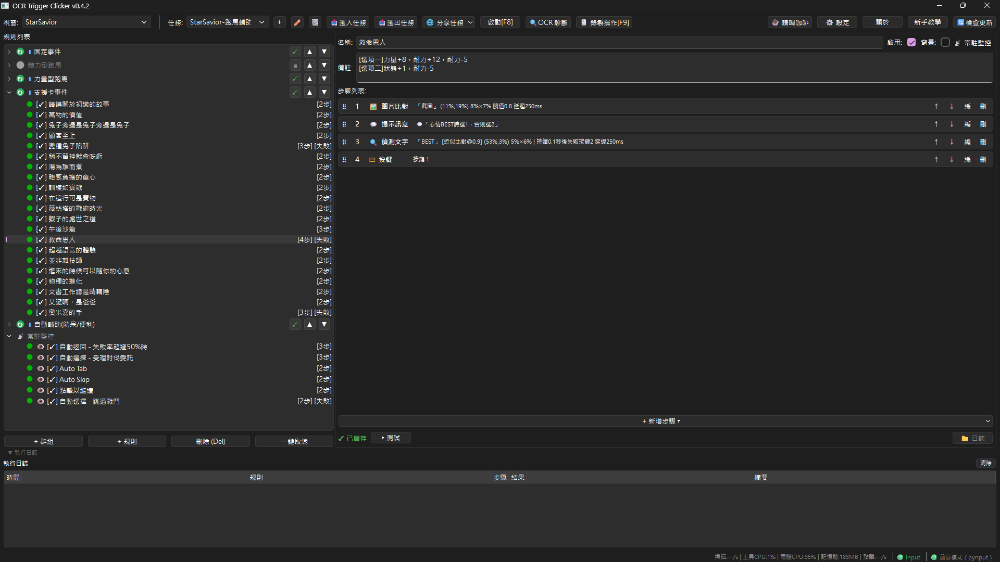
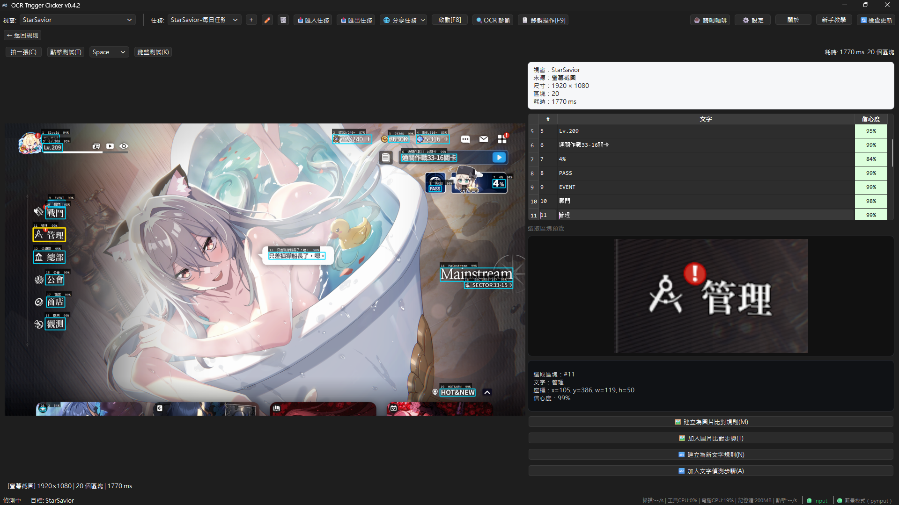

  

<h1 align="center">OCR Trigger Clicker</h1>

  <em>免寫程式的 Windows 自動化工具 — 偵測螢幕文字後自動點擊與按鍵</em> 
  支援繁體中文 / 簡體中文 UI 切換 · Author: Sid

  
  
  
  
  

  <a href="./README.en.md">English</a> · <a href="./README.zh-CN.md">简体中文</a> · <strong>繁體中文</strong>

---

> 🎯 **第一次使用？你是來「用」的，不是來看程式碼的。**
> 請看 [📖 快速上手指南](./START.md) — 3 分鐘從下載到啟動

---

## 預覽

   
  <em>規則列表 + 步驟編輯 — 深色主題、中文介面</em>

 

   
  <em>OCR 診斷 — 即時辨識畫面文字，按兩下直接建立規則</em>

---

## 它能做什麼

| 功能 | 說明 |
|:----:|------|
| 🔍 | **自動偵測螢幕上的字** — 設定要找的文字和觸發動作，找到就自動執行 |
| 🖼️ | **用圖片來找按鈕** — 截圖當範本比對，沒文字的地方也能用 |
| 🔗 | **多步驟串成流程** — 偵測→點擊→等待→拖曳…全部自動跑完 |
| 📂 | **不同場景切換任務** — 不同遊戲或工作存成獨立檔案，一鍵切換 |
| 📐 | **換螢幕也不怕** — 座標自動按比例調整，外接螢幕不用重設 |
| 👁️ | **看著畫面設定規則** — OCR 診斷面板列出所有文字，按兩下就建立規則 |

---

## 快速開始

  <kbd>1</kbd> 下載 <code>ocr-trigger-clicker.zip</code> → 解壓縮 → 執行 exe  
  <kbd>2</kbd> 選取目標視窗 → 按「啟動」

> 📖 詳細引導請看 [快速上手指南](./START.md)。

---

## 系統需求與安裝

- **Windows 10 / 11**（64 位元）
- 免安裝、免 Python 環境，下載 ZIP 解壓縮直接執行
- 如果遊戲沒反應，試試 **右鍵 → 以系統管理員身分執行**

---

<strong>📖 更多資訊</strong>

- 📖 [文件網站](https://sid-1996.github.io/ocr-trigger-clicker/) — 完整教學與範例
- 📂 [任務檔案分享](https://github.com/Sid-1996/ocr-trigger-clicker/discussions/categories/%E4%BB%BB%E5%8B%99%E6%AA%94%E6%A1%88%E5%88%86%E4%BA%AB) — 下載現成腳本
- 💬 [GitHub Discussions](https://github.com/Sid-1996/ocr-trigger-clicker/discussions) — 使用心得與討論
- 🐛 [Issues](https://github.com/Sid-1996/ocr-trigger-clicker/issues) — 問題回報
- ⭐ [GitHub 專案](https://github.com/Sid-1996/ocr-trigger-clicker) — 給一顆 Star 支持開發

<strong>🛠️ 給開發者</strong>

- [技術規格與比較表](./docs/dev/TECHNICAL.md)
- [系統架構](./docs/dev/ARCHITECTURE.md)
- [版本記錄](./docs/dev/CHANGELOG.md)

---

## 贊助開發者

---

  Copyright (C) 2024-2026 Sid · <a href="LICENSE">AGPLv3</a>

