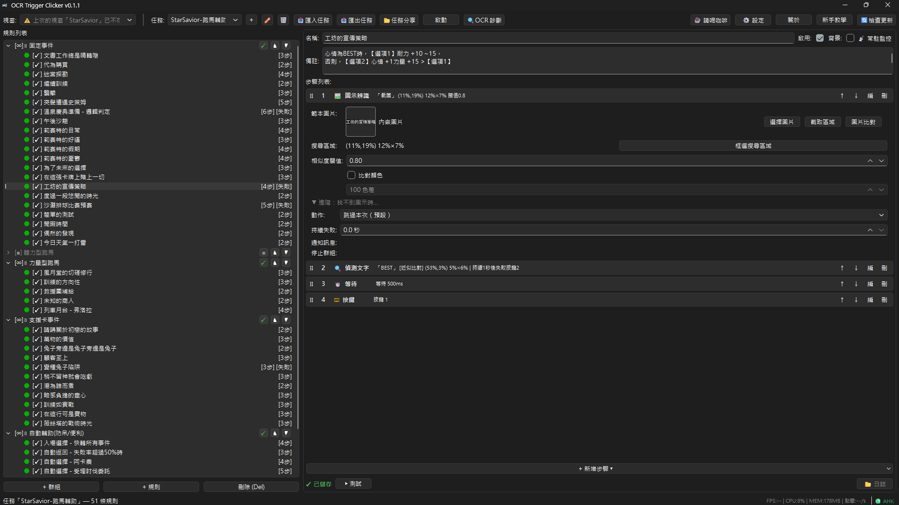
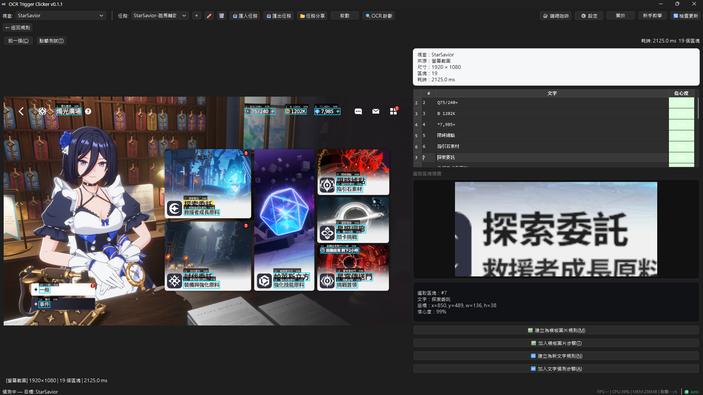

# OCR Trigger Clicker

> 免写代码的 Windows 自动化工具 — 通过 OCR 实时检测屏幕文字，自动执行鼠标点击与键盘操作。  
> 支持繁体中文 / 简体中文 UI 切换。Author: Sid

[**English**](./README.en.md) · **简体中文** · [**繁體中文**](./README.md)

---

## 目录

- [概述](#概述)
- [截图一览](#截图一览)
- [功能一览](#功能一览)
- [与其他工具比较](#与其他工具比较)
- [系统需求](#系统需求)
- [安装](#安装)
- [快速入门](#快速入门)
- [完整文档](#完整文档)
- [社区交流](#社区交流)
- [赞助开发者](#赞助开发者)
- [授权](#授权)

---

## 概述

OCR Trigger Clicker 是一款基于光学字符识别（OCR）的 Windows 自动化工具。它监控指定窗口的画面内容，当检测到用户设定的目标文字或图标时，自动执行鼠标点击、键盘按键、拖拽等动作。

**无代码（No-Code）**、**窗口比例坐标（跨分辨率兼容）**、**多语言界面**，让不具备编程背景的用户也能快速建立自动化规则。

---

## 截图一览

---

## 功能一览

- **OCR 文字检测** — 基于 RapidOCR，支持繁体／简体中文，可框选 ROI 减少干扰
- **图标模板比对** — OpenCV matchTemplate + NMS，比 OCR 快 10~50 倍，适合无文字按钮
- **窗口比例坐标** — 所有坐标存储为 0~1 比值，1080p / 4K / 缩放 150% 皆兼容
- **群组规则管理** — 拖拽排序、循环执行／执行一次／重复 N 次、群组并行与依序
- **步骤系统** — detect / click / key / wait / jump / compare / match_image / notify / scroll / drag，可组合复杂流程
- **常驻监控模式** — 不受群组流程影响，每帧独立执行，适合错误拦截
- **前景保护与安全机制** — 可选前景保护、速率限制、紧急停止
- **多任务管理** — 不同场景建立独立任务，快速切换，JSON 导入／导出

---

## 与其他工具比较

| 特性 | OCR Trigger Clicker | AutoHotkey | Airtest | AutoIt |
|------|:---:|:---:|:---:|:---:|
| 上手门槛 | ✅ 图形化界面，免写码 | ❌ 需手写脚本 | ⚠️ 需 Python 基础 | ❌ 需手写脚本 |
| OCR 文字检测 | ✅ 内置，支持繁中 | ❌ 需插件 | ⚠️ 有，但配置复杂 | ❌ 无 |
| 跨分辨率 | ✅ 比例坐标，自动适应 | ❌ 像素坐标，换屏幕就坏 | ❌ 同左 | ❌ 同左 |
| 图像模板比对 | ✅ 内置 OpenCV + NMS | ❌ 需插件 | ✅ 有 | ❌ 无 |
| 鼠标 / 键盘模拟 | ✅ AHK v2 TCP 通讯 | ✅ 原生支持 | ✅ 有 | ✅ 原生支持 |
| 多规则群组管理 | ✅ 拖拽排序、循环、跳转 | ❌ 需手写逻辑 | ❌ 需手写逻辑 | ❌ 需手写逻辑 |
| 开源免费 | ✅ AGPLv3 | ✅ 免费 | ✅ Apache 2.0 | ✅ 免费 |

---

## 系统需求

- Windows 10 / 11（64 位）
- [AutoHotkey v2](https://www.autohotkey.com/)（需自行安装）
- 使用预编译 EXE 无需 Python 环境

---

## 安装

1. 下载并安装 [AutoHotkey v2](https://www.autohotkey.com/)
2. 从 [Releases](https://github.com/Sid-1996/ocr-trigger-clicker/releases) 下载 `ocr-trigger-clicker.zip`
3. 解压后执行 `ocr-trigger-clicker.exe`
4. **以系统管理员身份运行**（若目标程序以管理员权限运行，否则点击无效）

---

## 快速入门

1. **选择窗口** — 从下拉菜单选取要监控的目标窗口
2. **建立群组** — 右键 → 新建群组，设定执行模式（循环执行／执行一次／重复 N 次）
3. **在群组内新增规则** — 设定检测文字、点击位置等步骤
4. **常驻监控** — 规则勾选「常驻监控」即自动归入 📡 节点，不参与群组顺序
5. **启动** — 点击「启动」→ 选择要执行的群组 → 开始检测

---

## 完整文档

详细的功能说明、使用教学、技术架构与常见问题，请参阅：

👉 [**文档网站**](https://sid-1996.github.io/ocr-trigger-clicker/)（含界面截图、工具教学、脚本设计范例）

---

## 社区交流

- 📂 **任务文件分享** — 想找现成脚本或分享自己的任务设定？欢迎到 [任务文件分享 Discussions](https://github.com/Sid-1996/ocr-trigger-clicker/discussions/categories/%E4%BB%BB%E5%8B%99%E6%AA%94%E6%A1%88%E5%88%86%E4%BA%AB) 交流。
- 💬 **一般讨论** — 使用心得、功能建议、疑难排解，都欢迎在 [GitHub Discussions](https://github.com/Sid-1996/ocr-trigger-clicker/discussions) 发起。
- 🐛 **问题反馈** — 遇到 bug 或想要新功能，请到 [Issues](https://github.com/Sid-1996/ocr-trigger-clicker/issues) 反馈。
- ⭐ 如果这套工具对你有帮助，欢迎到 [GitHub 项目](https://github.com/Sid-1996/ocr-trigger-clicker) 给一颗 Star 支持开发！

---

## 赞助开发者

- ☕ [ECPAY](https://p.ecpay.com.tw/E0E3A)
- ☕ [PayPal](https://www.paypal.com/ncp/payment/9TGC4B3MYM9A6)
- ☕ [爱发电](https://afdian.com/a/sid-1996)

---

## 授权

Copyright (C) 2024-2026 Sid

This program is free software: you can redistribute it and/or modify
it under the terms of the GNU Affero General Public License as published
by the Free Software Foundation, either version 3 of the License, or
(at your option) any later version.

This program is distributed in the hope that it will be useful,
but WITHOUT ANY WARRANTY; without even the implied warranty of
MERCHANTABILITY or FITNESS FOR A PARTICULAR PURPOSE.  See the
GNU Affero General Public License for more details.

You should have received a copy of the GNU Affero General Public License
along with this program.  If not, see <https://www.gnu.org/licenses/>.
